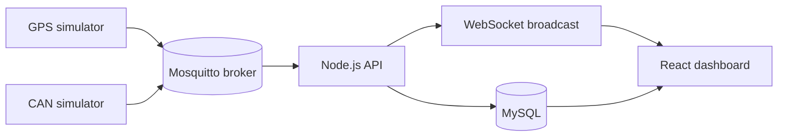

# SIV Transit Dashboard

SIV is a real-time Systeme d'Information Voyageur for public transport. This repository contains the MVP implementation: MQTT-based bus simulators, a Node.js backend, a MySQL database, and a React dashboard for live monitoring and operations.

## Overview

The platform receives GPS and CAN telemetry for each bus, stores the latest and historical data, exposes REST endpoints for the fleet, and displays the live state in a browser dashboard.

### What it does

- Simulates buses moving along predefined routes.
- Publishes GPS and CAN telemetry over MQTT.
- Persists positions, telemetry, alerts, lines, stations, and users in MySQL.
- Shows a live fleet map, vehicle details, ETA cards, and CRUD screens.
- Triggers alerts for heat, low fuel, connectivity loss, and unsafe door state.
- Optionally sends alert emails through SMTP.

## Architecture



## Tech Stack

- Backend: Node.js, Express, MQTT.js, WebSocket, MySQL
- Frontend: React, Vite, Leaflet, OpenStreetMap
- Infrastructure: Docker, Docker Compose, Mosquitto, MySQL
- Notifications: SMTP via Nodemailer

## Project Structure

- `backend/` - API, MQTT ingestion, alerting, authentication, WebSocket broadcast
- `frontend/` - dashboard UI and live map
- `simulators/` - GPS and CAN simulators
- `docker/` - MySQL schema, Mosquitto config, MQTT auth files
- `docker-compose.yml` - local multi-container runtime

## Features

### Included in the MVP

- Live map with active buses
- GPS ingestion every 5 seconds
- CAN telemetry ingestion every 5 seconds
- Bus, line, and station CRUD
- Bus detail view with current position, telemetry, and history
- Traveler-facing station and ETA view
- Real-time alert generation and history
- Optional SMTP email notifications for alerts

### Deferred to later versions

- Telegram or WhatsApp notifications
- AI-based delay prediction
- Mobile app
- Payment integration
- Advanced analytics and reporting
- Production-grade scaling and high availability

## API Endpoints

The backend is mounted under `/api`.

### Public

- `GET /api`
- `GET /health`
- `POST /api/auth/login`
- `GET /api/public/stations`
- `GET /api/public/lignes/:id/eta`

### Fleet management

- `GET /api/bus`
- `GET /api/bus/active`
- `GET /api/bus/:id`
- `GET /api/bus/:id/position`
- `GET /api/bus/:id/telemetrie`
- `GET /api/bus/:id/historique`
- `POST /api/bus`
- `PUT /api/bus/:id`
- `DELETE /api/bus/:id`

### Lines and stations

- `GET /api/lignes`
- `GET /api/lignes/:id`
- `POST /api/lignes`
- `PUT /api/lignes/:id`
- `DELETE /api/lignes/:id`
- `POST /api/stations`
- `PUT /api/stations/:id`
- `DELETE /api/stations/:id`

### Alerts

- `GET /api/alertes`
- `PATCH /api/alertes/:id/acquitter`
- `PATCH /api/alertes/acquitter-toutes`

## MQTT Topics

- `bus/+/gps` - GPS payloads
- `bus/+/can` - CAN telemetry payloads

### MQTT accounts

- Backend: `siv_backend` / `BackendPass2026`
- Simulators: `siv_simulator` / `SimPass2026`

## Database Model

The schema is defined in `docker/mysql/init.sql` and includes:

- `lignes`
- `stations`
- `bus`
- `positions`
- `telemetrie`
- `alertes`
- `horaires`
- `users`

Key behavior:

- `positions` stores GPS history.
- `telemetrie` stores CAN history.
- `alertes` stores generated alerts and acknowledgement state.
- `users` stores the demo admin account.

## Getting Started

### Prerequisites

- Docker Desktop
- PowerShell

### Start the stack

```powershell
cd "path to the repo\Project"
docker compose up --build -d
```

### Open the app

- Frontend: http://localhost:5173
- Backend: http://localhost:3000/api
- Health: http://localhost:3000/health

### Stop the stack

```powershell
cd "path to the repo\Project"
docker compose down
```

## Demo Credentials

- Username: `admin`
- Password: `admin123`

The backend refreshes this account on startup so the demo login works even if an old database volume already exists.

## Optional SMTP Alerts

Set these environment variables before starting Docker if you want email delivery for new alerts:

- `SMTP_HOST`
- `SMTP_PORT`
- `SMTP_SECURE`
- `SMTP_USER`
- `SMTP_PASS`
- `SMTP_FROM`
- `ALERT_EMAIL_TO`

If these variables are not set, alerts still persist in the database and broadcast to the UI, but no email is sent.

## Development Notes

- Mosquitto runs with authentication and ACLs enabled.
- The broker configuration is built from the local `docker/mosquitto/` directory.
- The frontend reads the API at `http://localhost:3000/api` by default.

## Troubleshooting

- If login fails, restart the backend container so the admin seed is refreshed.
- If MQTT clients cannot connect, rebuild the Mosquitto image so the password file and ACL are included.
- If Docker Compose reports stale containers, run `docker compose down` before starting again.

## Roadmap

The current codebase is focused on the MVP. Future iterations can add richer notifications, predictive analytics, and hardware integration with ESP32 or similar devices.
